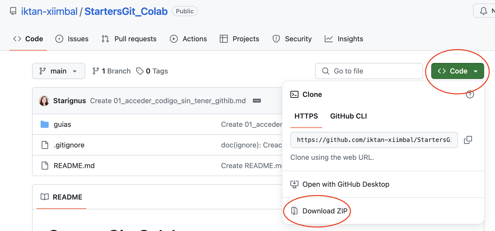

# ¿Cómo acceder al código sin tener una cuenta de GitHub?

En resumen, GitHub es una plataforma para guardar código, controlar sus versiones y colaborar con otros. Si quieres 
saber más sobre GitHub, mira este [documento](https://docs-github-com.translate.goog/es/get-started/start-your-journey/hello-world?_x_tr_sl=en&_x_tr_tl=es&_x_tr_hl=en-US&_x_tr_pto=wapp&_x_tr_hist=true).

Si ya usas GitHub, puedes clonar cualquier repositorio público (hacer una copia en tu cuenta). Aquí te explicamos cómo 
clonar un [repositorio](https://docs.github.com/es/repositories/creating-and-managing-repositories/cloning-a-repository).

Pero **no es necesario tener una cuenta de GitHub para acceder a cualquier material** que esté dentro de un repositorio. Puedes descargar 
todos los materiales directamente a tu computadora. Haz clic en "Code" (Código) y luego en "Download ZIP" 
(Descargar ZIP) para descargar todo.

## Información general a cerca de Git y las plataformas que alojan proyectos que usan Git

* [**Git**](https://es.wikipedia.org/wiki/Git) es un programa que ayuda a llevar un registro de los cambios que se 
hacen en los archivos de un proyecto, especialmente cuando muchas personas trabajan en él a la vez. Esto es muy útil 
para organizar el trabajo en equipo y mantener un historial de cómo ha evolucionado el proyecto. Si quires saber 
como isntalarlo en Windows, aquí te dejamos una [liga a un video](https://www.youtube.com/watch?v=WcYTcttEf50&t=46s).

* GitHub, GitLab y BitBucket son tres de las plataformas más populares para alojar proyectos que usan Git. 
En esencia, todas ofrecen lo mismo y son herramientas clave para los desarrolladores:
  * **Control de versiones (Git)**: permiten llevar un registro de los cambios en el código a lo largo del tiempo.
  * **Almacenamiento del código**: guardan el código del proyecto en un lugar seguro y accesible.
  * **Seguridad integrada**: incluyen medidas de seguridad para proteger el código de accesos no autorizados.

En caso de que quieras crear una cuenta de GitHub puede acceder las instrucciones en es [documento](https://docs.github.com/es/get-started/start-your-journey/creating-an-account-on-github).

Puedes usar GitHub Desktop para permitirte contribuir en proyectos directamente desde tu máquina. Esta es 
una [liga](https://docs.github.com/es/desktop/overview/getting-started-with-github-desktop) para aprendas cómo ajustar, 
autenticar y configurar GitHub Desktop y está otra [liga](https://www.youtube.com/watch?v=lx0rnIYVy1s&t=1s) para que 
puedas instalarlo. 

